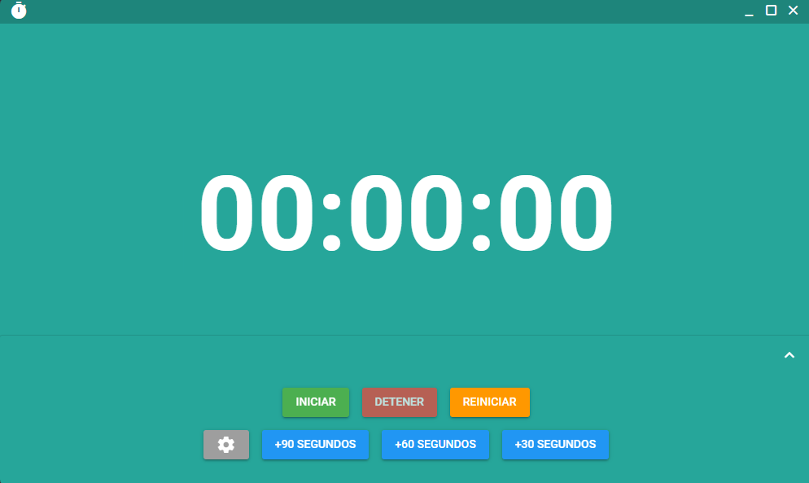
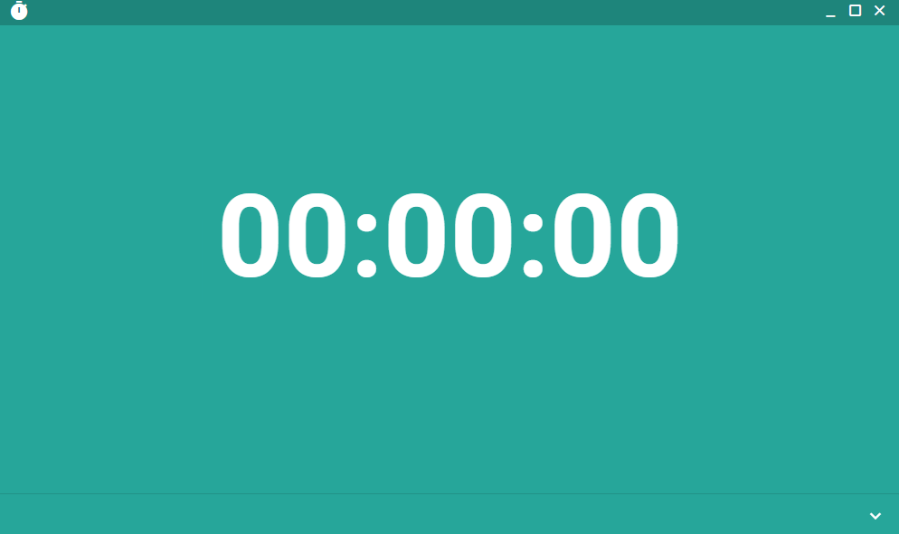
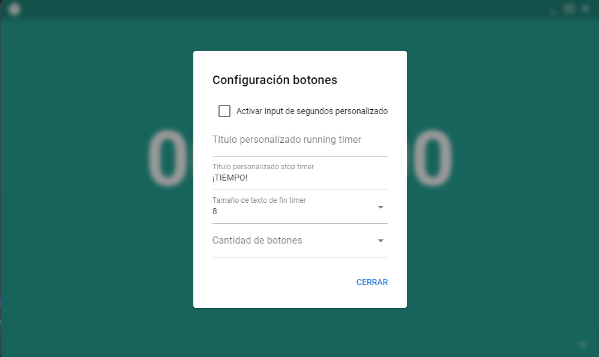
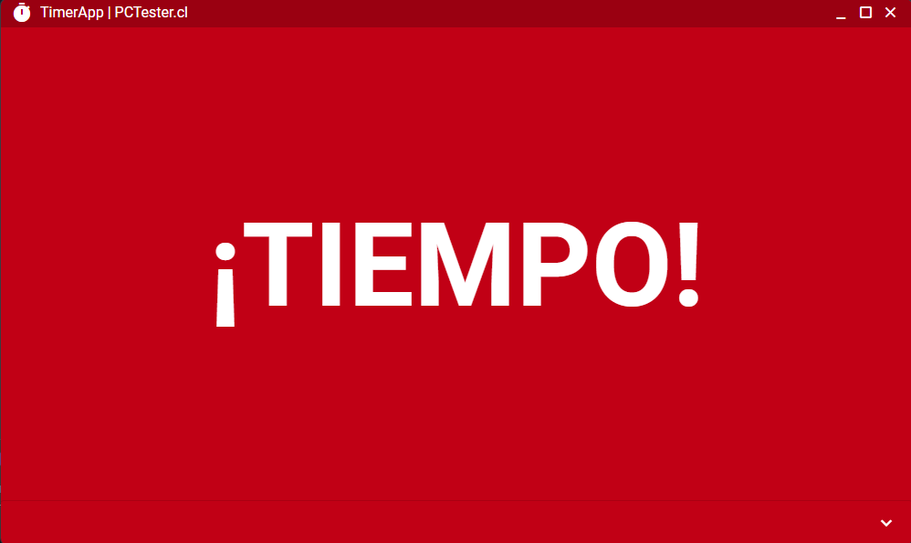

# TimerApp (timer-app) | PCTester.cl

proyecto temporizador
Timer application project

</img>
</img>
</img>
</img>
</img>

## Install the dependencies
```bash
pnpm install
```

### Start the app in development mode (hot-code reloading, error reporting, etc.)
```bash
pnpm dev:win
```


### Build the app for production
```bash
pnpm build:win
```

### Customize the configuration
See [Configuring quasar.config.js](https://v2.quasar.dev/quasar-cli-vite/quasar-config-js).
